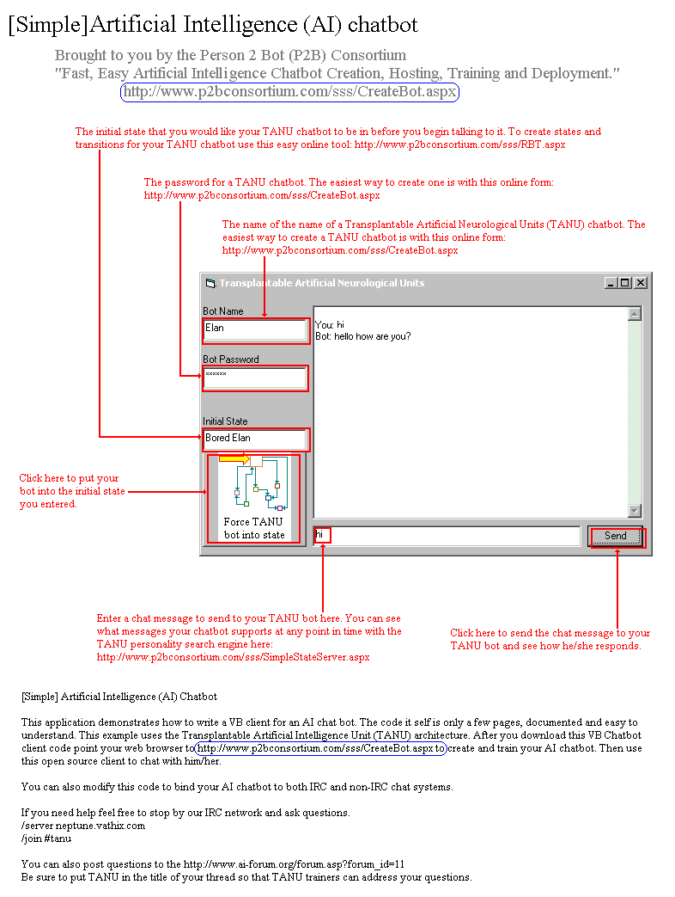

<div align="center">

## \[  A Simple \] Artificial Intelligence \(AI\) Chatbot


</div>

### Description

This application demonstrates how to write a VB client for an AI chat bot. The code it self is only a few pages, documented and easy to understand. This example uses the Transplantable Artificial Neurological Units (TANU) architecture. After you download this VB Chatbot client code point your web browser to http://www.p2bconsortium.com/sss/CreateBot.aspx to create and train your AI chatbot. Then use this open source client to chat with him/her.

You can also modify this code to bind your AI chatbot to both IRC and non-IRC chat systems.

If you need help feel free to stop by our IRC network and ask questions.

/server neptune.vathix.com

/join #tanu

You can also post questions to the http://www.ai-forum.org/forum.asp?forum_id=11

Be sure to put TANU in the title of your thread so that TANU trainers can address your questions.
 
### More Info
 


<span>             |<span>
---                |---
**Submitted On**   |2003-10-17 14:12:22
**By**             |[lonetron](https://github.com/Planet-Source-Code/PSCIndex/blob/master/ByAuthor/lonetron.md)
**Level**          |Advanced
**User Rating**    |4.2 (88 globes from 21 users)
**Compatibility**  |VB 6\.0, VB Script, ASP \(Active Server Pages\) 
**Category**       |[Complete Applications](https://github.com/Planet-Source-Code/PSCIndex/blob/master/ByCategory/complete-applications__1-27.md)
**World**          |[Visual Basic](https://github.com/Planet-Source-Code/PSCIndex/blob/master/ByWorld/visual-basic.md)
**Archive File**   |[\[\_\_A\_Simpl16601410172003\.zip](https://github.com/Planet-Source-Code/lonetron-a-simple-artificial-intelligence-ai-chatbot__1-49250/archive/master.zip)

### API Declarations

```
Private Declare Function ShellExecute Lib "shell32.dll" Alias "ShellExecuteA" (ByVal hWnd As Long, ByVal lpOperation As String, ByVal lpFile As String, ByVal lpParameters As String, ByVal lpDirectory As String, ByVal nShowCmd As Long) As Long
```


